# LunarCrime

### Overview
*	Does a full moon impact crime rate?
    * 	In this project, we analyze 2016 crime rates in three major US cities - Baltimore, Boston and Philadelphia as they relate to a full moon. We consider various types of crime while observing the cycles of the moon attempting to find a correlation between the lunar cycle and crime rate. 
    * 	Hypothesis: On days where full moons occur, the crime rates are greater.

## Analysis Process 
*	For the year 2016, we analyzed each month individually to find the below information:
    *   The day the full moon took place in that month
    
    

### January
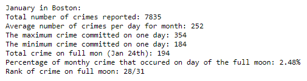
![January bargraph](./img/

### February
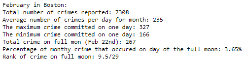
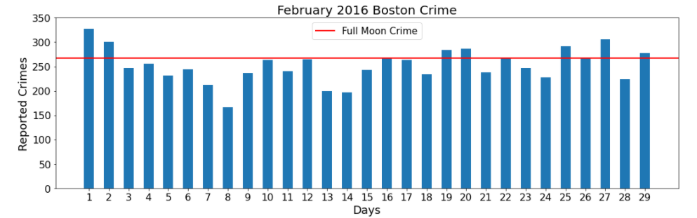

### March
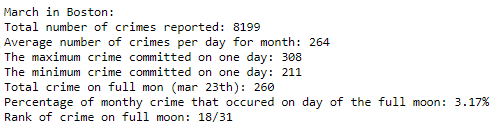
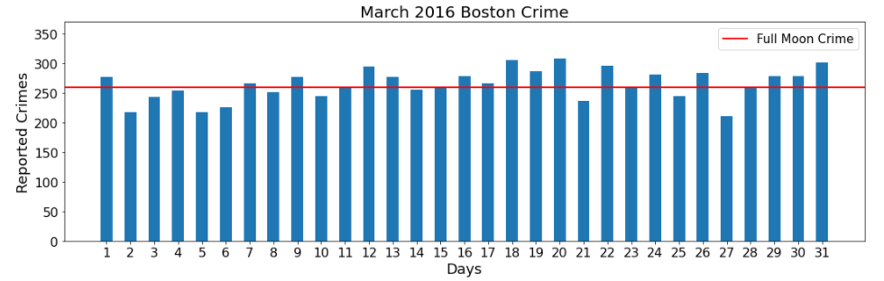

### April
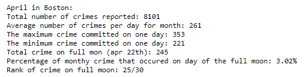
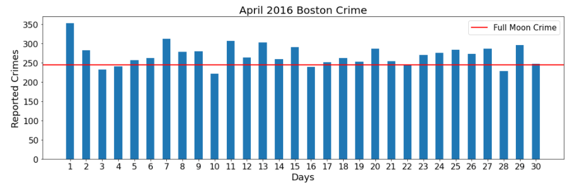

### May
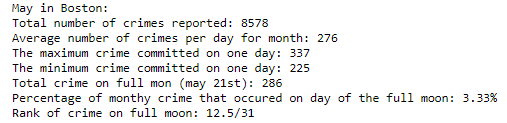
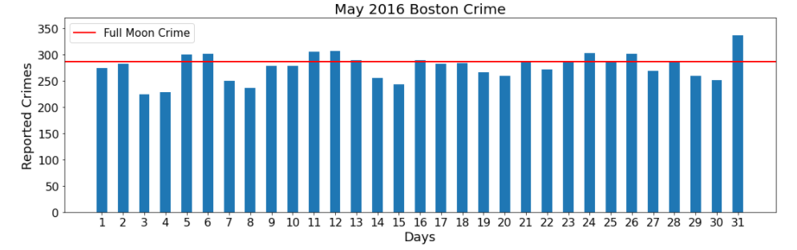

### June
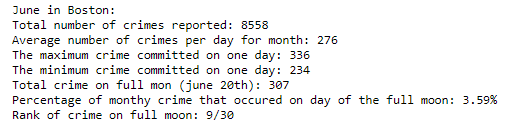
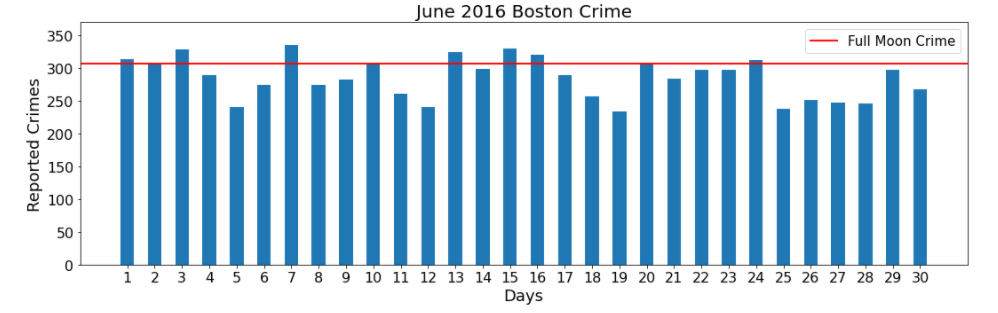

### July
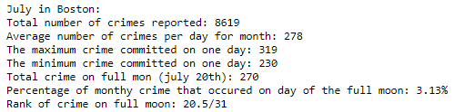
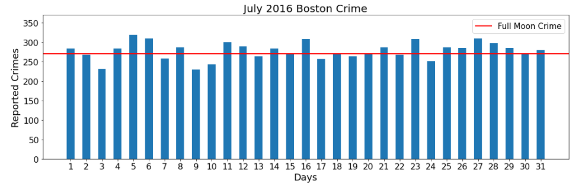

### August
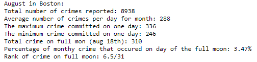
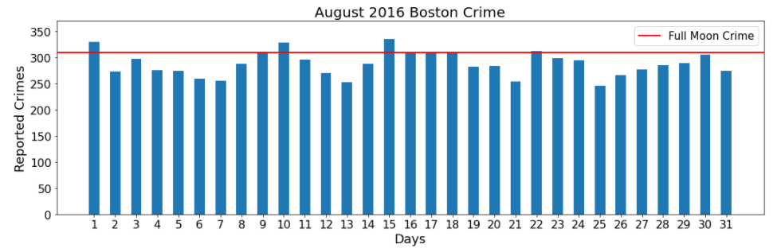

### Spetember
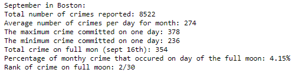
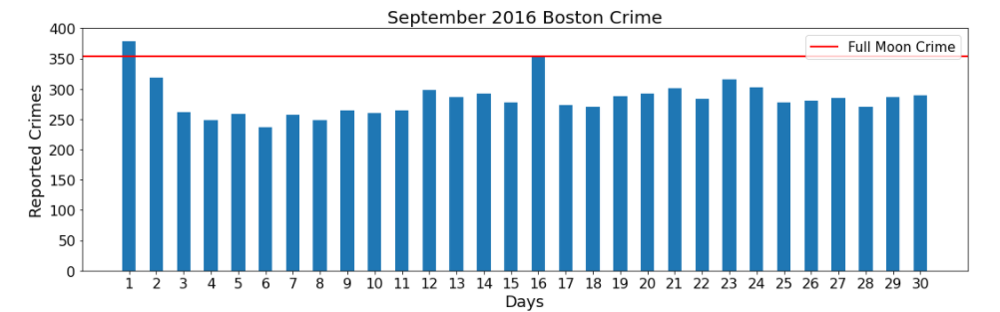

### October
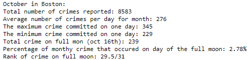
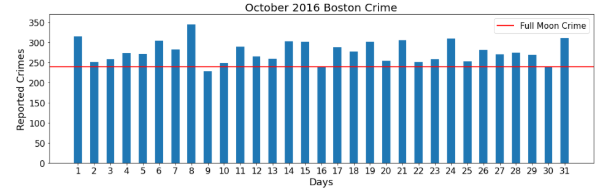

### November
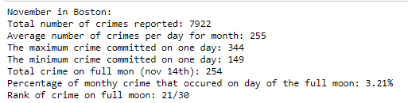
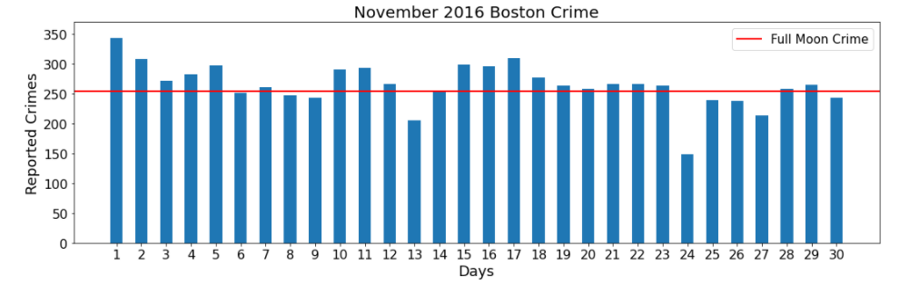

### December
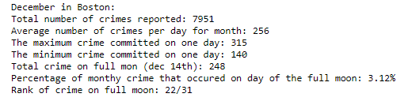
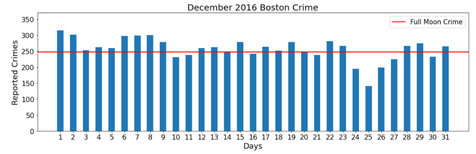
